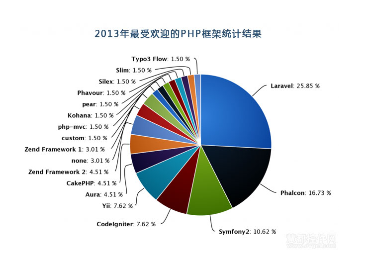
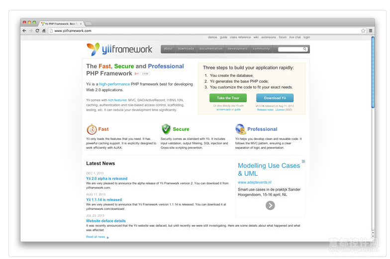
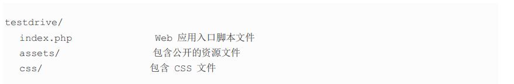
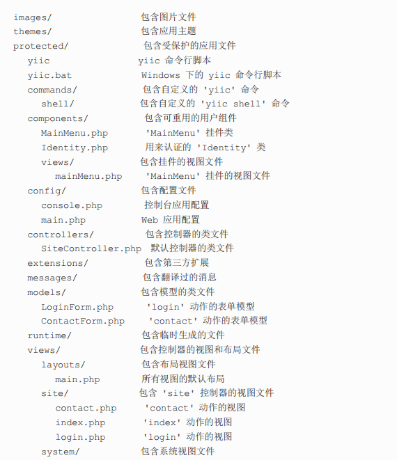
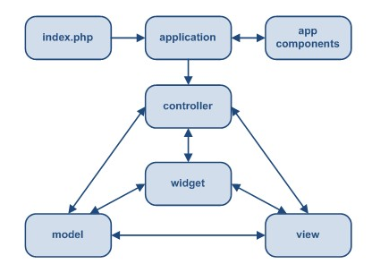
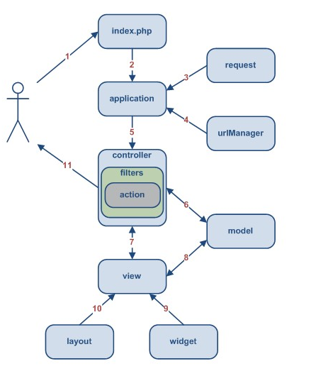


#PHP语言及框架介绍
PHP是一种通用开源脚本语言。语法吸收了C语言、Java和Perl的特点，入门门槛较低，易于学习，使用广泛，主要适用于Web开发领域。9月期间对1500万台互联网上的服务器进行了测试。报告上显示PHP在服务器上占有34.30%的使用率，仍然是互联网上最常用的技术。PHP被77.9%的服务端编程语言已知的网站使用。PHP作为网络开发的强大语言之一，具有开放源代码，跨平台性强，开发快捷，效率高，面向对象，专业专注等诸多优点。目前在各大互联网公司广泛使用，在中小型网站以及创业团队中也有很多应用。

框架就是通过提供一个开发Web程序的基本架构，加速了软件的开发流程，可以节约时间，同时创建更为稳定的程序，并减少开发者的重复编写代码的劳动。各种PHP开发框架也让程序开发变的简单有效。这些框架还通过确保正确的数据库操作以及只在表现层编程的方式帮助初学者创建稳定的程序。并减少开发者的重复编写代码的劳动。PHP开发框架使得你可以花更多的时间去创造真正的Web程序，而不是编写重复性的代码。

#####目前PHP框架类型很多，如下图所示：

#Yii框架介绍
#####今天分享下工作中用到的Yii框架以及MVC编程。

Yii是一个高性能的，适用于开发WEB2.0应用的PHP框架。Yii几乎拥有了所有的特性，包括MVC、DAO/ActiveRecord、I18N/L10N、caching、基于JQuery的AJAX支持、用户认证和基于角色的访问控制、脚手架、输入验证、部件、事件、主题化以及Web服务等等。Yii采用严格的OOP编写，Yii使用简单，非常灵活，具有很好的可扩展性。名字Yii（读音是Yee or [ji:]，应该就是“易”的读音 ）代表的是容易(easy)，高效(efficient)和可扩展(extensible)。

#####其代码树形目录结构如下：

Yii 实现了 Web  编程中广为采用的“模型-视图-控制器”(MVC)设计模式。MVC 致力于分离业务逻辑和用户界面，这样开发者可以很容易地修改某个部分而不影响其它。在 MVC 中，模型表现信息（数据）和业务规则；视图包含用户界面中用到的元素，比如文本、表单输入框；控制器管理模型和视图间的交互。除了 MVC，Yii 还引入了一个叫做 application 的前端控制器，它表现整个请求过程的运行环境。Application 接收用户的请求并把它分发到合适的控制器作进一步处理。

#####下图为一个 Yii  应用的静态结构：

#####下图为一个 Yii 应用处理用户请求时的典型流程：

- 1. 用户访问 http://www.example.com/index.php?r=post/show&id=1，Web 服务器执行入口脚本 index.php 来处理该请求。
- 2. 入口脚本建立一个应用实例并运行之。
- 3. 应用从一个叫 request 的应用部件获得详细的用户请求信息。
- 4. 通过 urlManager 这个应用部件，确定用户要请求的控制器和动作。
- 5. 应用建立一个被请求的控制器实例来进一步处理用户请求，控制器确定由它的actionShow 方法来处理 show 动作。然后它建立并应用和该动作相关的过滤器，如果过滤器允许的话，动作被执行。
- 6. 动作从数据库读取一个 ID 为 1 的 Post 模型。
- 7. 动作使用 Post 模型来渲染一个叫 show 的视图。
- 8. 视图读取 Post 模型的属性并显示之。
- 9. 视图运行一些挂件。
- 10. 视图的渲染结果嵌在布局中。
- 11. 动作结束视图渲染并显示结果给用户。

#Yii框架MVC编程
#####MVC全名是Model View Controller，是模型(model)－视图(view)－控制器(controller)的缩写，一种软件设计典范，用一种业务逻辑、数据、界面显示分离的方法组织代码，将业务逻辑聚集到一个部件里面，在改进和个性化定制界面及用户交互的同时，不需要重新编写业务逻辑。MVC被独特的发展起来用于映射传统的输入、处理和输出功能在一个逻辑的图形化用户界面的结构中。	

##控制器（Controller）
控制器是 CController 或者其子类的实例。 用户请求应用时，创建控制器。 控制器执行请求action，action通常引入必要的模型并提供恰当的视图。 最简单的action仅仅是一个控制器类方法，此方法的名字以action开始。

控制器有默认的action。用户请求没指定哪一个action执行时，将执行默认的action。 缺省情况下，默认的action名为index。可以通过设置CController::defaultAction改变默认的action。

下边是最小的控制器。因为控制器未定义任何action，请求时会抛出异常。

	class SiteController extends CController	
	{	
	}

CWebApplication在处理一个新请求时，实例化一个控制器。程序通过控制器的ID，并按一定规则确定控制器类及控制器类所在位置。一个动作可以定义为一个函数或者一个动作类。当请求这个动作时，控制器实例化这个类。这样就可以复用和重用动作。

过滤器是配置为控制器动作之前或之后执行的一段代码。例如可以设计一个性能过滤器用于计时动作执行的时间。一个动作可以有多个过滤器。过滤器可以定义为控制器类的方法，也可以是CFilter类的子类。
##模型（Model）

模型是 CModel 或其子类的实例。 模型用于保持数据以及和数据相关的业务规则。模型描述了一个单独的数据对象。它可以是数据表中的一行数据或者用户输入的一个表单。数据中的各个字段都描述了模型的一个属性。这些属性都有一个标签，都可以被一套可靠的规则验证。

Yii 从表单模型和 active record 实现了两种模型。 它们都继承自基类 CModel。

表单模型是CFormModel的实例。表单模型用于保存通过收集用户输入得来的数据。这样的数据通常被收集，使用，然后被抛弃。例如，在一个登录页面上，我们可以使用一个表单模型来描述诸如用户名，密码这样的由最终用户提供的信息。

Active Record (AR) 是一种面向对象风格的，用于抽象数据库访问的设计模式。任何一个 AR 对象都是 CActiveRecord 或其子类的实例， 它描述的数据表中的单独一行数据。这行数据中的字段被描述成 AR 对象的一个属性。
##模型（View）

视图是一个包含了主要的用户交互元素的PHP脚本。他可以包含PHP语句，但是建议这些语句不要去改变数据模型，且最好能够保持其单纯性(单纯作为视图)!为了实现逻辑和界面分离，大部分的逻辑应该被放置于控制器或模型里，而不是视图里。

视图有一个当其被渲染(render)时用于校验的名称。视图的名称与其脚本名称是一样的。例如:视图 edit 的名称出自一个名为 edit.php 的脚本文件。通过 CController::render() 调用视图的名称可以渲染一个视图。这个方法将在 protected/views/ControllerID 目录下寻找对应的视图文件。

在视图脚本内部，可以通过 $this 来访问控制器实例。可以在视图里以 $this->propertyName 的方式 pull 控制器的任何属性。也可以用以下 push 的方式传递数据到视图里:

	$this->render('edit'， array(
	'var1'=>$value1，
	'var2'=>$value2，
	));
在以上的方式中， render() 方法将提取数组的两个参数到变量里。其产生的结果是，在视图脚本里，我们可以直接访问变量 $var1 和 $var2。
布局是一种特殊的视图文件用来修饰视图。它通常包含了用户交互过程中常用到的一部分视图。

组件是 CWidget 或其子类的实例。它是一个主要用于描述特定意图的组成部分。组件通常内嵌于一个视图来产生一些复杂却独立的用户界面。例如，一个日历组件可以用于渲染一个复杂的日历界面。组件可以在用户界面上更好的实现重用。

系统视图的渲染通常用于展示 Yii 的错误和日志信息。例如，当用户请求来一个不存在的控制器或动作时，Yii 会抛出一个异常来解释这个错误。 这时，Yii 就会使用一个特殊的系统视图来展示这个错误。

#Yii框架开发流程描述

####前文中描述了yii的基本概念，现在我们看看用yii开发一个web程序的基本流程。前提是我这个程序我们已经做了需求分析和必要的设计分析。

1. 创建目录结构。在前面的章节Creating First Yii Application写的yiic工具可以帮助我们快速完成这步。
2.  配置 application。就是修改application配置文件。这步有可能会写一些application部件(例如：用户部
件) 
3.  每种类型的数据都创建一个 model 类来管理。 同样，yiic可以为我们需要的数据库表自动生成active 
record active record 类。
4.  每种类型的用户请求都创建一个 controller 类。 依据实际的需求对用户请求进行分类。一般来说，如果
一个model类需要用户访问，就应该对应一个controller类。yiic工具也能自动完成这步。
5.  实现 actions 和相应的 views。这是真正需要我们编写的工作。
6.  在controller类里配置需要的action filters 。
7.  如果需要主题功能，编写 themes。
8.  如果需要 internationalization 国际化功能，编写翻译语句。
9.  使用 caching 技术缓存数据和页面。
10. 最后 tune up调整程序和发布。
 

以上每个步骤，有可能需要编写测试案例来测试。

####PS: 以上内容整理自百度百科，yii框架中文手册教程，以及其他网页资料